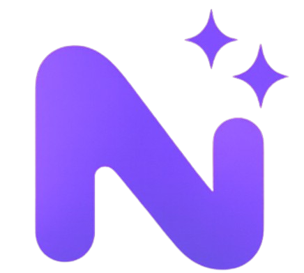

  

# Nuviw

**Nuviw** is an AI-powered platform that enables anyone to create and publish professional websites with unprecedented speed and simplicity.  

---

## 🚀 What We Do

Nuviw democratizes web creation by combining powerful AI assistance with an intuitive, real-time visual editor:

- **AI Website Generation** — Build full websites from a simple prompt.  
- **Visual Editor** — Instantly edit layouts, text, media, and structure.  
- **AI Editing Tools** — Rewrite, extend, or restyle any content in one click.  
- **Custom Domain Publishing** — Connect a personal domain and publish in seconds.  
- **SEO-Ready Output** — Automated metadata, sitemap generation, and optimized structure.  
- **Template Library (In Development)** — Curated templates for faster creation and onboarding.  
- **Cross-Device Sync** — Accounts will sync across the web app and all future mobile apps.  
- **Multi-Platform Expansion** — Web app in active development; iOS prototype nearing TestFlight; Android app scheduled for next year.

---

## 📈 Vision

Nuviw aims to create a seamless ecosystem where creators, entrepreneurs, and businesses can instantly transform ideas into polished, ready-to-publish websites — without requiring technical expertise.

We envision a future where web creation is fast, accessible, and magical for everyone.

---

## 💼 For Investors

Nuviw is expanding rapidly, strengthening its feature set, platform integrations, and product ecosystem.  
We aim to establish ourselves as the leading AI-driven website creation tool in LATAM and then scale globally.

### Current Progress
- **iOS App Prototype:** In final stages, preparing for TestFlight rollout.  
- **Web App:** Actively growing; shared accounts across devices and web underway.  
- **Android App:** Planned for release next year.  
- **Platform Infrastructure:** Continuous scalability improvements and new AI features.  
- **Website Evolution:** Ongoing data collection and iteration on messaging, UX, and funnel.

### Strategic Roadmap
- Scalable and modular web infrastructure  
- Domain reseller integration and instant domain provisioning  
- Advanced membership and token-based creation tiers  
- AI-powered interactive web-app generation  
- Multi-platform presence (Web, iOS, Android)  
- Extended template system for faster user onboarding  

We welcome conversations with investors and partners interested in supporting Nuviw’s long-term growth and technological impact.

---

## 🌐 Official Links

- **Website:** https://nuviw.com  
- **X (Twitter):** https://x.com/nuviw_app  
- **Instagram:** https://www.instagram.com/nuviw_app  
- **YouTube:** https://www.youtube.com/@Nuviw_app  
- **TikTok:** https://www.tiktok.com/@nuviw_app  
- **LinkedIn:** https://www.linkedin.com/company/nuviw/  
- **Facebook:** https://www.facebook.com/profile.php?id=61584947333899  

---

**Nuviw — Think it. Type it. Share it.**
